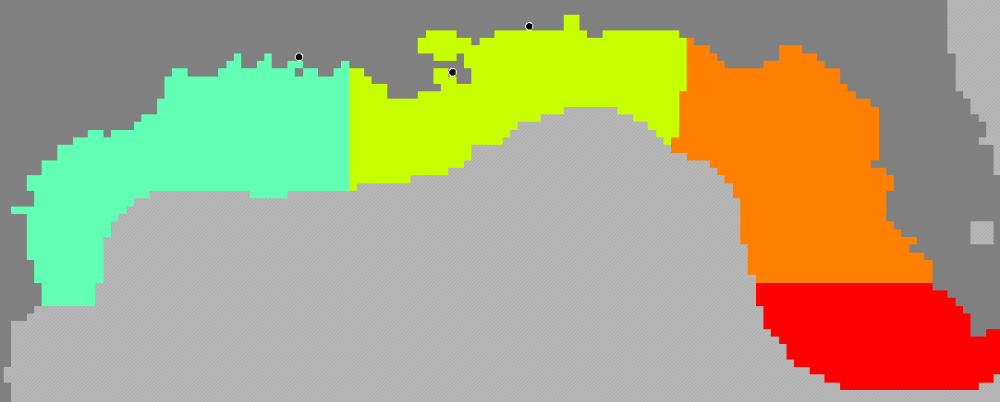

```{r setup, include=FALSE}
knitr::opts_chunk$set(echo = TRUE,fig.pos = "H", out.extra = "")
appendicies = FALSE #Set to True if we are to print all of the appendicies.
```

## Summary
- Created several metrics to diagnose Ecospace
- Each environmental driver affects functional groups differently
- Bottom temperature changes produce weird clumping of groups
- Dispersal metrics are not consistent among groups, but within groups show a pattern
- Catch and Discard temporal trends look forced in the model
- Relative changes follow in all regions, suggesting forced fishing effort is felt evenly
- Really need a way to calibrate spatially

## Problem Statement
- Ecospace may be fitting weird
- Need Ecospace to create realistic population movements (e.g., seasonal movements)


## Objectives
- Understand drivers of population dynamics
- Quantify how each environmental variable affect trends
- Compare regional trends to overall trends

## Methods
- Set up Ecosim model with vulnerabilities scaled to trophic level
  - Previous discussions suggest SS may not be the best calibration method, particularly considering the lack of spatial consideration in Ecosim
- Applied time series forcings and left all forcing functions and environmental responses the same
  - Many of these were applied by Holden
- Set up several Ecospace scenarios within the spatial-temporal framework (Table 1)

```{r scenario_table, echo = F}
scen_names = c("no_driver","surface_temp","bottom_temp","chla_prod","salt","all_driver")
scen_description = c("No environmental drivers applied","Only surface temperatures are dynamic","Only bottom temperatures are dynamic","Monthly CHLa concentrations drive monthly primary productivity","Only water-coumn integrated salinity is applied","All environmental drivers are applied")
scenarios = data.frame(Number = seq(1,length(scen_names),1),Name = scen_names,Description = scen_description)
library(knitr)
kable(scenarios, caption="Scenarios run in Ecospace")
```

- Created regions corresponding to geographical areas (LATex shelf, Mississippi River outflow, West Florida Shelf, Dry Tortugas; Figure 1)

```{r regions, echo = F, fig.cap="The regions applied in regional analyses aligning with basic regions in the Gulf of Mexico. LaTex shelf (green), Mississippi River (yellow), West Florida Shelf (orange), Dry Tortugas (red).", out.width= "100%"}

```

- Quantify the influence of each driver on population and ecosystem scale metrics
- Gather several metrics:
  - Biomass, catch, discards (t/km2)
  - Fishing effort (units?)
  - Habitat Capacity
  - Ecosystem-scale indicators
  
- Conduct analyses:
  - Center of mass movement
  - Spatially explicit end/start for all metrics
  - Compare population dispersion at start/end of simulation
  - Overall trends vs. regional trends

## Results
### Distribution Shifts

Click <u><span style="color: blue">[here](https://drive.google.com/drive/u/3/folders/1em04ZOwoVVyJZjcsnM4ZcB-dPkyAtGT3)</span></u> for full outputs.

#### Biomass
```{r biomass distributions, echo = F,message=F,warning=F}
library(dplyr)
library(tidyr)
library(geosphere)
library(knitr)

dat = read.csv("./Results/Biomass Center of Masses.csv") %>% filter(Time %in% c(min(Time),max(Time)))
pivoted_data <- dat %>%
  mutate(Lon = round(Lon, 2),Lat = round(Lat, 2)) %>%
  pivot_wider(names_from = Time,values_from = c(Lon, Lat),names_glue = "{.value}_{Time}")

pivoted_data <- pivoted_data %>%
  mutate(Coordinates_1981 = paste0("(", Lat_1981, ", ", Lon_1981, ")"),Coordinates_2017 = paste0("(", Lat_2017, ", ", Lon_2017, ")"))

pivoted_data <- pivoted_data %>%
  rowwise() %>%
  mutate(Distance_km = round(distHaversine(c(Lon_1981, Lat_1981),c(Lon_2017, Lat_2017)) / 1000,1)) %>%
  filter(Distance_km > 50) %>% 
  ungroup()

final_data <- pivoted_data %>%
  rename_with(~ gsub("Coordinates_", "", .x), starts_with("Coordinates_")) %>%
  dplyr::select(Scenario, Group, `1981`, `2017`, Distance_km) %>% 
  arrange(Scenario)

final_data$Scenario <- ifelse(duplicated(final_data$Scenario), "", final_data$Scenario)

kable(final_data, col.names = c("Scenario", "Group", "1981 (Lat, Lon)", "2017 (Lat, Lon)", "Distance (km)"), align = "l",caption="Biomass center of mass distribution shifts for all functional groups in all scenarios that moved greater than 50km from the 1981 starting point. Coordinates represent the center of mass of the population.")

```

```{r biomass CM summary, echo=FALSE, message = FALSE, warning = FALSE, fig.cap = "Summarized Biomass movement infomration. A) The number of functional groups that moved greater than 50km by scenario. B) The maximum distance (km) traveled by a functional group per scenario."}
library(ggpubr)
library(ggplot2)

# Create the counts data
counts <- pivoted_data %>%
  group_by(Scenario) %>%
  summarize(Counts = n())

# Create and display the ggplot
counted = ggplot(counts, aes(x = Scenario, y = Counts)) +
  geom_bar(stat = "identity") +
  theme_classic()+
  theme(axis.text.x = element_text(angle=45,hjust=1))+
  labs(y="Number of groups w/ > 50km movement")


maxes <- pivoted_data %>%
  group_by(Scenario) %>%
  summarize(Max = max(Distance_km))

maxed = ggplot(maxes, aes(x = Scenario, y = Max)) +
  geom_bar(stat = "identity") +
  theme_classic()+
  theme(axis.text.x = element_text(angle=45,hjust=1))+
  labs(y="Maximum Distance (km)")

full = ggarrange(counted,maxed,labels = c("A","B"),ncol = 2)
```

#### Catch

```{r catch distributions, echo = F,message=F,warning=F}
library(dplyr)
library(tidyr)
library(geosphere)
library(knitr)

dat = read.csv("./Results/Catch Center of Masses.csv") %>% filter(Time %in% c(min(Time),max(Time)))
pivoted_data <- dat %>%
  mutate(Lon = round(Lon, 2),Lat = round(Lat, 2)) %>%
  pivot_wider(names_from = Time,values_from = c(Lon, Lat),names_glue = "{.value}_{Time}")

pivoted_data <- pivoted_data %>%
  mutate(Coordinates_1981 = paste0("(", Lat_1981, ", ", Lon_1981, ")"),Coordinates_2017 = paste0("(", Lat_2017, ", ", Lon_2017, ")"))

pivoted_data <- pivoted_data %>%
  rowwise() %>%
  mutate(Distance_km = round(distHaversine(c(Lon_1981, Lat_1981),c(Lon_2017, Lat_2017)) / 1000,1)) %>%
  filter(Distance_km > 50) %>% 
  ungroup()

final_data <- pivoted_data %>%
  rename_with(~ gsub("Coordinates_", "", .x), starts_with("Coordinates_")) %>%
  dplyr::select(Scenario, Group, `1981`, `2017`, Distance_km) %>% 
  arrange(Scenario)

final_data$Scenario <- ifelse(duplicated(final_data$Scenario), "", final_data$Scenario)

kable(final_data, col.names = c("Scenario", "Group", "1981 (Lat, Lon)", "2017 (Lat, Lon)", "Distance (km)"), align = "l",caption="Catch center of mass distribution shifts for all functional groups in all scenarios that moved greater than 50km from the 1981 starting point. Coordinates represent the center of mass of the population.")

```

```{r catch CM summary, echo=FALSE, message = FALSE, warning = FALSE, fig.cap = "Summarized Catch movement infomration. A) The number of functional groups that moved greater than 50km by scenario. B) The maximum distance (km) traveled by a functional group per scenario."}
library(ggpubr)
library(ggplot2)

# Create the counts data
counts <- pivoted_data %>%
  group_by(Scenario) %>%
  summarize(Counts = n())

# Create and display the ggplot
counted = ggplot(counts, aes(x = Scenario, y = Counts)) +
  geom_bar(stat = "identity") +
  theme_classic()+
  theme(axis.text.x = element_text(angle=45,hjust=1))+
  labs(y="Number of groups w/ > 50km movement")


maxes <- pivoted_data %>%
  group_by(Scenario) %>%
  summarize(Max = max(Distance_km))

maxed = ggplot(maxes, aes(x = Scenario, y = Max)) +
  geom_bar(stat = "identity") +
  theme_classic()+
  theme(axis.text.x = element_text(angle=45,hjust=1))+
  labs(y="Maximum Distance (km)")

full = ggarrange(counted,maxed,labels = c("A","B"),ncol = 2)
full
```

#### Discards
```{r discards distributions, echo = F,message=F,warning=F}
library(dplyr)
library(tidyr)
library(geosphere)
library(knitr)

dat = read.csv("./Results/Biomass Center of Masses.csv") %>% filter(Time %in% c(min(Time),max(Time)))
pivoted_data <- dat %>%
  mutate(Lon = round(Lon, 2),Lat = round(Lat, 2)) %>%
  pivot_wider(names_from = Time,values_from = c(Lon, Lat),names_glue = "{.value}_{Time}")

pivoted_data <- pivoted_data %>%
  mutate(Coordinates_1981 = paste0("(", Lat_1981, ", ", Lon_1981, ")"),Coordinates_2017 = paste0("(", Lat_2017, ", ", Lon_2017, ")"))

pivoted_data <- pivoted_data %>%
  rowwise() %>%
  mutate(Distance_km = round(distHaversine(c(Lon_1981, Lat_1981),c(Lon_2017, Lat_2017)) / 1000,1)) %>%
  filter(Distance_km > 50) %>% 
  ungroup()

final_data <- pivoted_data %>%
  rename_with(~ gsub("Coordinates_", "", .x), starts_with("Coordinates_")) %>%
  dplyr::select(Scenario, Group, `1981`, `2017`, Distance_km) %>% 
  arrange(Scenario)

final_data$Scenario <- ifelse(duplicated(final_data$Scenario), "", final_data$Scenario)

kable(final_data, col.names = c("Scenario", "Group", "1981 (Lat, Lon)", "2017 (Lat, Lon)", "Distance (km)"), align = "l",caption="Biomass center of mass distribution shifts for all functional groups in all scenarios that moved greater than 50km from the 1981 starting point. Coordinates represent the center of mass of the population.")

```

```{r discards CM summary, echo=FALSE, message = FALSE, warning = FALSE, fig.cap = "Summarized Discards movement infomration. A) The number of functional groups that moved greater than 50km by scenario. B) The maximum distance (km) traveled by a functional group per scenario."}
library(ggpubr)
library(ggplot2)

# Create the counts data
counts <- pivoted_data %>%
  group_by(Scenario) %>%
  summarize(Counts = n())

# Create and display the ggplot
counted = ggplot(counts, aes(x = Scenario, y = Counts)) +
  geom_bar(stat = "identity") +
  theme_classic()+
  theme(axis.text.x = element_text(angle=45,hjust=1))+
  labs(y="Number of groups w/ > 50km movement")


maxes <- pivoted_data %>%
  group_by(Scenario) %>%
  summarize(Max = max(Distance_km))

maxed = ggplot(maxes, aes(x = Scenario, y = Max)) +
  geom_bar(stat = "identity") +
  theme_classic()+
  theme(axis.text.x = element_text(angle=45,hjust=1))+
  labs(y="Maximum Distance (km)")

full = ggarrange(counted,maxed,labels = c("A","B"),ncol = 2)
full
```

#### Fishing Effort
```{r effort distributions, echo = F,message=F,warning=F}
library(dplyr)
library(tidyr)
library(geosphere)
library(knitr)

dat = read.csv("./Results/Effort Center of Masses.csv") %>% filter(Time %in% c(min(Time),max(Time)))
pivoted_data <- dat %>%
  mutate(Lon = round(Lon, 2),Lat = round(Lat, 2)) %>%
  pivot_wider(names_from = Time,values_from = c(Lon, Lat),names_glue = "{.value}_{Time}")

pivoted_data <- pivoted_data %>%
  mutate(Coordinates_1981 = paste0("(", Lat_1981, ", ", Lon_1981, ")"),Coordinates_2017 = paste0("(", Lat_2017, ", ", Lon_2017, ")"))

pivoted_data <- pivoted_data %>%
  rowwise() %>%
  mutate(Distance_km = round(distHaversine(c(Lon_1981, Lat_1981),c(Lon_2017, Lat_2017)) / 1000,1)) %>%
  filter(Distance_km > 50) %>% 
  ungroup()

final_data <- pivoted_data %>%
  rename_with(~ gsub("Coordinates_", "", .x), starts_with("Coordinates_")) %>%
  dplyr::select(Scenario, Group, `1981`, `2017`, Distance_km) %>% 
  arrange(Scenario)

final_data$Scenario <- ifelse(duplicated(final_data$Scenario), "", final_data$Scenario)

kable(final_data, col.names = c("Scenario", "Group", "1981 (Lat, Lon)", "2017 (Lat, Lon)", "Distance (km)"), align = "l",caption="Fishing Effort center of mass distribution shifts for all functional groups in all scenarios that moved greater than 50km from the 1981 starting point. Coordinates represent the center of mass of the population.")

```

```{r effort CM summary, echo=FALSE, message = FALSE, warning = FALSE, fig.cap = "Summarized fishing effort movement infomration. A) The number of functional groups that moved greater than 50km by scenario. B) The maximum distance (km) traveled by a functional group per scenario."}
library(ggpubr)
library(ggplot2)

# Create the counts data
counts <- pivoted_data %>%
  group_by(Scenario) %>%
  summarize(Counts = n())

# Create and display the ggplot
counted = ggplot(counts, aes(x = Scenario, y = Counts)) +
  geom_bar(stat = "identity") +
  theme_classic()+
  theme(axis.text.x = element_text(angle=45,hjust=1))+
  labs(y="Number of groups w/ > 50km movement")


maxes <- pivoted_data %>%
  group_by(Scenario) %>%
  summarize(Max = max(Distance_km))

maxed = ggplot(maxes, aes(x = Scenario, y = Max)) +
  geom_bar(stat = "identity") +
  theme_classic()+
  theme(axis.text.x = element_text(angle=45,hjust=1))+
  labs(y="Maximum Distance (km)")

full = ggarrange(counted,maxed,labels = c("A","B"),ncol = 2)
full
```

#### Habitat Capacity
```{r capacity distributions, echo = F,message=F,warning=F}
library(dplyr)
library(tidyr)
library(geosphere)
library(knitr)

dat = read.csv("./Results/HabitatCapacity Center of Masses.csv") %>% filter(Time %in% c(min(Time),max(Time)))
pivoted_data <- dat %>%
  mutate(Lon = round(Lon, 2),Lat = round(Lat, 2)) %>%
  pivot_wider(names_from = Time,values_from = c(Lon, Lat),names_glue = "{.value}_{Time}")

pivoted_data <- pivoted_data %>%
  mutate(Coordinates_1981 = paste0("(", Lat_1981, ", ", Lon_1981, ")"),Coordinates_2017 = paste0("(", Lat_2017, ", ", Lon_2017, ")"))

pivoted_data <- pivoted_data %>%
  rowwise() %>%
  mutate(Distance_km = round(distHaversine(c(Lon_1981, Lat_1981),c(Lon_2017, Lat_2017)) / 1000,1)) %>%
  filter(Distance_km > 50) %>% 
  ungroup()

final_data <- pivoted_data %>%
  rename_with(~ gsub("Coordinates_", "", .x), starts_with("Coordinates_")) %>%
  dplyr::select(Scenario, Group, `1981`, `2017`, Distance_km) %>% 
  arrange(Scenario)

final_data$Scenario <- ifelse(duplicated(final_data$Scenario), "", final_data$Scenario)

kable(final_data, col.names = c("Scenario", "Group", "1981 (Lat, Lon)", "2017 (Lat, Lon)", "Distance (km)"), align = "l",caption="Habitat Capacity center of mass distribution shifts for all functional groups in all scenarios that moved greater than 50km from the 1981 starting point. Coordinates represent the center of mass of the population.")

```

```{r capacity CM summary, echo=FALSE, message = FALSE, warning = FALSE, fig.cap = "Summarized habitat capacity movement infomration. A) The number of functional groups that moved greater than 50km by scenario. B) The maximum distance (km) traveled by a functional group per scenario."}
library(ggpubr)
library(ggplot2)

# Create the counts data
counts <- pivoted_data %>%
  group_by(Scenario) %>%
  summarize(Counts = n())

# Create and display the ggplot
counted = ggplot(counts, aes(x = Scenario, y = Counts)) +
  geom_bar(stat = "identity") +
  theme_classic()+
  theme(axis.text.x = element_text(angle=45,hjust=1))+
  labs(y="Number of groups w/ > 50km movement")


maxes <- pivoted_data %>%
  group_by(Scenario) %>%
  summarize(Max = max(Distance_km))

maxed = ggplot(maxes, aes(x = Scenario, y = Max)) +
  geom_bar(stat = "identity") +
  theme_classic()+
  theme(axis.text.x = element_text(angle=45,hjust=1))+
  labs(y="Maximum Distance (km)")

full = ggarrange(counted,maxed,labels = c("A","B"),ncol = 2)
full
```

#### Indicators
```{r indicator distributions, echo = F,message=F,warning=F}
library(dplyr)
library(tidyr)
library(geosphere)
library(knitr)

dat = read.csv("./Results/Indicator Center of Masses.csv") %>% filter(Time %in% c(min(Time),max(Time)))
pivoted_data <- dat %>%
  mutate(Lon = round(Lon, 2),Lat = round(Lat, 2)) %>%
  pivot_wider(names_from = Time,values_from = c(Lon, Lat),names_glue = "{.value}_{Time}")

pivoted_data <- pivoted_data %>%
  mutate(Coordinates_1981 = paste0("(", Lat_1981, ", ", Lon_1981, ")"),Coordinates_2017 = paste0("(", Lat_2017, ", ", Lon_2017, ")"))

pivoted_data <- pivoted_data %>%
  rowwise() %>%
  mutate(Distance_km = round(distHaversine(c(Lon_1981, Lat_1981),c(Lon_2017, Lat_2017)) / 1000,1)) %>%
  filter(Distance_km > 50) %>% 
  ungroup()

final_data <- pivoted_data %>%
  rename_with(~ gsub("Coordinates_", "", .x), starts_with("Coordinates_")) %>%
  dplyr::select(Scenario, Group, `1981`, `2017`, Distance_km) %>% 
  arrange(Scenario)

final_data$Scenario <- ifelse(duplicated(final_data$Scenario), "", final_data$Scenario)

kable(final_data, col.names = c("Scenario", "Group", "1981 (Lat, Lon)", "2017 (Lat, Lon)", "Distance (km)"), align = "l",caption="Indicator center of mass distribution shifts for all functional groups in all scenarios that moved greater than 50km from the 1981 starting point. Coordinates represent the center of mass of the population.")

```

```{r indicator CM summary, echo=FALSE, message = FALSE, warning = FALSE, fig.cap = "Summarized indicator movement infomration. A) The number of functional groups that moved greater than 50km by scenario. B) The maximum distance (km) traveled by a functional group per scenario."}
library(ggpubr)
library(ggplot2)

# Create the counts data
counts <- pivoted_data %>%
  group_by(Scenario) %>%
  summarize(Counts = n())

# Create and display the ggplot
counted = ggplot(counts, aes(x = Scenario, y = Counts)) +
  geom_bar(stat = "identity") +
  theme_classic()+
  theme(axis.text.x = element_text(angle=45,hjust=1))+
  labs(y="Number of groups w/ > 50km movement")


maxes <- pivoted_data %>%
  group_by(Scenario) %>%
  summarize(Max = max(Distance_km))

maxed = ggplot(maxes, aes(x = Scenario, y = Max)) +
  geom_bar(stat = "identity") +
  theme_classic()+
  theme(axis.text.x = element_text(angle=45,hjust=1))+
  labs(y="Maximum Distance (km)")

full = ggarrange(counted,maxed,labels = c("A","B"),ncol = 2)
full
```

### End/Start 

Click <u><span style="color: blue">[here](https://drive.google.com/drive/u/3/folders/1em04ZOwoVVyJZjcsnM4ZcB-dPkyAtGT3)</span></u> for full outputs.


### Dispersion

Click <u><span style="color: blue">[here](https://drive.google.com/drive/u/3/folders/1em04ZOwoVVyJZjcsnM4ZcB-dPkyAtGT3)</span></u> for full outputs.

#### Biomass

The dispersion of biomass changes over time as populations move. Hypothetically, this is driven by ideal habitat.

```{r biomass dispersion, fig.cap="Summary of the influence of each environmental driver scenario towards the dispersion of functional groups using various metrics.",echo = FALSE,warning=F,message=F,fig.align='center',fig.height=4,fig.width=6}
library(dplyr)
library(tidyr)
library(ggplot2)

colorblind_palette <- function(n) {
  base_colors <- c("#E69F00", "#56B4E9", "#009E73", "#F0E442", "#0072B2", "#D55E00", "#CC79A7", "#999999")
  if (n > length(base_colors)) {
    color_palette <- colorRampPalette(base_colors)(n)
  } else {
    color_palette <- base_colors[1:n]
  }
  return(color_palette)
}

dat = read.csv("./Results/Biomass Dispersal Metrics.csv")

result <- dat %>%
  pivot_longer(cols = range:kurtosis, names_to = "Metric", values_to = "Value") %>%
  group_by(Scenario, Metric) %>%
  summarize(positive = sum(Value > 0),negative = sum(Value < 0),.groups = "drop")

data_long <- result %>%
  pivot_longer(cols = positive:negative, names_to = "Count_Type", values_to = "Count")

cols = colorblind_palette(n_distinct(data_long$Scenario))

plot = ggplot(data_long,aes(x=Metric,y=Count,fill=Scenario))+
  geom_vline(xintercept = seq(1.5,6.5,1),linetype="dashed",alpha=0.4)+
  geom_bar(stat = "identity", position = "dodge") +
  facet_wrap(~ Count_Type, scales = "free_x", strip.position = "bottom") +
  labs(title = "Biomass Dispersal Changes",y = "Count",fill = "Scenario") +
  scale_fill_manual(values = cols)+
  theme_classic() +
  theme(axis.text.x = element_text(angle = 75,hjust=1))
plot
         
```

#### Catch

The dispersion of catch changes over time as populations and fisheries move.

```{r catch dispersion, fig.cap="Summary of the influence of each environmental driver scenario towards the dispersion of functional groups using various metrics.",echo = FALSE,warning=F,message=F,fig.align='center',fig.height=4,fig.width=6}
library(dplyr)
library(tidyr)
library(ggplot2)

colorblind_palette <- function(n) {
  base_colors <- c("#E69F00", "#56B4E9", "#009E73", "#F0E442", "#0072B2", "#D55E00", "#CC79A7", "#999999")
  if (n > length(base_colors)) {
    color_palette <- colorRampPalette(base_colors)(n)
  } else {
    color_palette <- base_colors[1:n]
  }
  return(color_palette)
}

dat = read.csv("./Results/Catch Dispersal Metrics.csv")

result <- dat %>%
  pivot_longer(cols = range:kurtosis, names_to = "Metric", values_to = "Value") %>%
  drop_na(Value) %>% 
  group_by(Scenario, Metric) %>%
  summarize(positive = sum(Value > 0),negative = sum(Value < 0),.groups = "drop")

data_long <- result %>%
  pivot_longer(cols = positive:negative, names_to = "Count_Type", values_to = "Count")

cols = colorblind_palette(n_distinct(data_long$Scenario))

plot = ggplot(data_long,aes(x=Metric,y=Count,fill=Scenario))+
  geom_vline(xintercept = seq(1.5,6.5,1),linetype="dashed",alpha=0.4)+
  geom_bar(stat = "identity", position = "dodge") +
  facet_wrap(~ Count_Type, scales = "free_x", strip.position = "bottom") +
  labs(title = "Catch Dispersal Changes",y = "Count",fill = "Scenario") +
  scale_fill_manual(values = cols)+
  theme_classic() +
  theme(axis.text.x = element_text(angle = 75,hjust=1))

plot
         
```

#### Discards

The dispersion of discards changes over time as populations and fisheries move.

```{r Discards dispersion, fig.cap="Summary of the influence of each environmental driver scenario towards the dispersion of functional groups using various metrics.",echo = FALSE,warning=F,message=F,fig.height=4,fig.width=6}
library(dplyr)
library(tidyr)
library(ggplot2)

colorblind_palette <- function(n) {
  base_colors <- c("#E69F00", "#56B4E9", "#009E73", "#F0E442", "#0072B2", "#D55E00", "#CC79A7", "#999999")
  if (n > length(base_colors)) {
    color_palette <- colorRampPalette(base_colors)(n)
  } else {
    color_palette <- base_colors[1:n]
  }
  return(color_palette)
}

dat = read.csv("./Results/Discards Dispersal Metrics.csv")

result <- dat %>%
  pivot_longer(cols = range:kurtosis, names_to = "Metric", values_to = "Value") %>%
  drop_na(Value) %>% 
  group_by(Scenario, Metric) %>%
  summarize(positive = sum(Value > 0),negative = sum(Value < 0),.groups = "drop")

data_long <- result %>%
  pivot_longer(cols = positive:negative, names_to = "Count_Type", values_to = "Count")

cols = colorblind_palette(n_distinct(data_long$Scenario))

plot = ggplot(data_long,aes(x=Metric,y=Count,fill=Scenario))+
  geom_vline(xintercept = seq(1.5,6.5,1),linetype="dashed",alpha=0.4)+
  geom_bar(stat = "identity", position = "dodge") +
  facet_wrap(~ Count_Type, scales = "free_x", strip.position = "bottom") +
  labs(title = "Discards Dispersal Changes",y = "Count",fill = "Scenario") +
  scale_fill_manual(values = cols)+
  theme_classic() +
  theme(axis.text.x = element_text(angle = 75,hjust=1))

plot
         
```

#### Fishing Effort

The dispersion of fishing effort changes over time fisheries move.

```{r effort dispersion, fig.cap="Summary of the influence of each environmental driver scenario towards the dispersion of functional groups using various metrics.",echo = FALSE,warning=F,message=F,fig.height=4,fig.width=6}
library(dplyr)
library(tidyr)
library(ggplot2)

colorblind_palette <- function(n) {
  base_colors <- c("#E69F00", "#56B4E9", "#009E73", "#F0E442", "#0072B2", "#D55E00", "#CC79A7", "#999999")
  if (n > length(base_colors)) {
    color_palette <- colorRampPalette(base_colors)(n)
  } else {
    color_palette <- base_colors[1:n]
  }
  return(color_palette)
}

dat = read.csv("./Results/Effort Dispersal Metrics.csv")

result <- dat %>%
  pivot_longer(cols = range:kurtosis, names_to = "Metric", values_to = "Value") %>%
  drop_na(Value) %>% 
  group_by(Scenario, Metric) %>%
  summarize(positive = sum(Value > 0),negative = sum(Value < 0),.groups = "drop")

data_long <- result %>%
  pivot_longer(cols = positive:negative, names_to = "Count_Type", values_to = "Count")

cols = colorblind_palette(n_distinct(data_long$Scenario))

plot = ggplot(data_long,aes(x=Metric,y=Count,fill=Scenario))+
  geom_vline(xintercept = seq(1.5,6.5,1),linetype="dashed",alpha=0.4)+
  geom_bar(stat = "identity", position = "dodge") +
  facet_wrap(~ Count_Type, scales = "free_x", strip.position = "bottom") +
  labs(title = "Fishing Effort Dispersal Changes",y = "Count",fill = "Scenario") +
  scale_fill_manual(values = cols)+
  theme_classic() +
  theme(axis.text.x = element_text(angle = 75,hjust=1))

plot
         
```

#### Habitat Capacity

The dispersion of habitat capacity changes over time with environmental characteristics change and is driven by the input functional responses

```{r capacity dispersion, fig.cap="Summary of the influence of each environmental driver scenario towards the dispersion of functional groups using various metrics.",echo = FALSE,warning=F,message=F,fig.height=4,fig.width=6}
library(dplyr)
library(tidyr)
library(ggplot2)

colorblind_palette <- function(n) {
  base_colors <- c("#E69F00", "#56B4E9", "#009E73", "#F0E442", "#0072B2", "#D55E00", "#CC79A7", "#999999")
  if (n > length(base_colors)) {
    color_palette <- colorRampPalette(base_colors)(n)
  } else {
    color_palette <- base_colors[1:n]
  }
  return(color_palette)
}

dat = read.csv("./Results/HabitatCapacity Dispersal Metrics.csv")

result <- dat %>%
  pivot_longer(cols = range:kurtosis, names_to = "Metric", values_to = "Value") %>%
  drop_na(Value) %>% 
  group_by(Scenario, Metric) %>%
  summarize(positive = sum(Value > 0),negative = sum(Value < 0),.groups = "drop")

data_long <- result %>%
  pivot_longer(cols = positive:negative, names_to = "Count_Type", values_to = "Count")

cols = colorblind_palette(n_distinct(data_long$Scenario))

plot = ggplot(data_long,aes(x=Metric,y=Count,fill=Scenario))+
  geom_vline(xintercept = seq(1.5,6.5,1),linetype="dashed",alpha=0.4)+
  geom_bar(stat = "identity", position = "dodge") +
  facet_wrap(~ Count_Type, scales = "free_x", strip.position = "bottom") +
  labs(title = "Habitat Capacity Dispersal Changes",y = "Count",fill = "Scenario") +
  scale_fill_manual(values = cols)+
  theme_classic() +
  theme(axis.text.x = element_text(angle = 75,hjust=1))

plot
         
```

#### Indicators

All aspects mentioned above should change the dispersion of indicators as long as they are consistent within the indicator type.

```{r indicator dispersion, fig.cap="Summary of the influence of each environmental driver scenario towards the dispersion of functional groups using various metrics.",echo = FALSE,warning=F,message=F,fig.height=4,fig.width=6}
library(dplyr)
library(tidyr)
library(ggplot2)

colorblind_palette <- function(n) {
  base_colors <- c("#E69F00", "#56B4E9", "#009E73", "#F0E442", "#0072B2", "#D55E00", "#CC79A7", "#999999")
  if (n > length(base_colors)) {
    color_palette <- colorRampPalette(base_colors)(n)
  } else {
    color_palette <- base_colors[1:n]
  }
  return(color_palette)
}

dat = read.csv("./Results/Indicator Dispersal Metrics.csv")

result <- dat %>%
  pivot_longer(cols = range:kurtosis, names_to = "Metric", values_to = "Value") %>%
  drop_na(Value) %>% 
  group_by(Scenario, Metric) %>%
  summarize(positive = sum(Value > 0),negative = sum(Value < 0),.groups = "drop")

data_long <- result %>%
  pivot_longer(cols = positive:negative, names_to = "Count_Type", values_to = "Count")

cols = colorblind_palette(n_distinct(data_long$Scenario))

plot = ggplot(data_long,aes(x=Metric,y=Count,fill=Scenario))+
  geom_vline(xintercept = seq(1.5,6.5,1),linetype="dashed",alpha=0.4)+
  geom_bar(stat = "identity", position = "dodge") +
  facet_wrap(~ Count_Type, scales = "free_x", strip.position = "bottom") +
  labs(title = "Indicators Dispersal Changes",y = "Count",fill = "Scenario") +
  scale_fill_manual(values = cols)+
  theme_classic() +
  theme(axis.text.x = element_text(angle = 75,hjust=1))

plot
         
```

### Temporal Trends
Visit [this link](https://drive.google.com/drive/u/3/folders/18PvxynYe7pownOvn1V_Y7mzkMWhhycUw) for detailed outputs without plotting them.

#### Biomass
```{r biomass trend correlation,echo = FALSE,warning=F,message=F,fig.height=4,fig.width=6,out.width="100%"}
library(knitr)
  
# List all image files in the directory
files <- list.files("./Outputs/Biomass/trend/",pattern = ".*\\.png$", full.names = TRUE)
  
knitr::include_graphics(files)
```

#### Catch
```{r catch trend correlation,echo = FALSE,warning=F,message=F,fig.height=4,fig.width=6,out.width="100%"}
library(knitr)
  
# List all image files in the directory
files <- list.files("./Outputs/Catch/trend",pattern = ".*\\.png$", full.names = TRUE)
  
knitr::include_graphics(files)
```

#### Landings
```{r landings trend correlation,echo = FALSE,warning=F,message=F,fig.height=4,fig.width=6,out.width="100%"}
library(knitr)
  
# List all image files in the directory
files <- list.files("./Outputs/Landings/trend",pattern = ".*\\.png$", full.names = TRUE)
  
knitr::include_graphics(files)
```

### Offset Biomass and Catch Center of Masses
```{r biomass & catch CM,echo = FALSE,warning=F,message=F,fig.height=4,fig.width=6,out.width="100%",out.height="100%"}
library(knitr)
  
# List all image files in the directory
files <- list.files("./Outputs/",pattern = ".*\\.png$", full.names = TRUE)
  
knitr::include_graphics(files)

```

## Interpretation
- Bottom Temperature
  - Driving a lot of movement
  - That movement seems to be centered to the mouth of the Mississippi River
  
- Surface Temperature
  - The obvious choice for driving much of the patterns
  - Moves animals the furthest, but not all of them
  
- ChlA Production
  - Concentrates animals towards Mississippi River mouth
  - Negates much of the easterly movement of populations seen in the surface temperature scenario

## Appendix
Visit [this link](https://drive.google.com/drive/u/3/folders/18PvxynYe7pownOvn1V_Y7mzkMWhhycUw) for detailed outputs without plotting them.


### Distribution Shifts
- Biomass
```{r biomass CM appendix, fig.align='center', echo=FALSE, warning=FALSE, message=FALSE,out.width="100%"}

if (appendicies == T){
  library(knitr)
  
  # List all image files in the directory
  files <- list.files("./Outputs/Biomass/center_masses/diff/", full.names = TRUE)
  
  knitr::include_graphics(files)
}
```

- Catch
```{r catch CM appendix, fig.align='center', echo=FALSE, warning=FALSE, message=FALSE,out.width="100%"}

if (appendicies == T){
  library(knitr)
  
  # List all image files in the directory
  files <- list.files("./Outputs/Catch/center_masses/diff/", full.names = TRUE)
  
  knitr::include_graphics(files)
}
```

- Fmort
```{r Fmort CM appendix, fig.align='center', echo=FALSE, warning=FALSE, message=FALSE,out.width="100%"}

if (appendicies == T){
  library(knitr)
  
  # List all image files in the directory
  files <- list.files("./Outputs/Fmort/center_masses/diff/", full.names = TRUE)
  
  knitr::include_graphics(files)
}
```

- Discards
```{r discards CM appendix, fig.align='center', echo=FALSE, warning=FALSE, message=FALSE,out.width="100%"}

if (appendicies == T){
  library(knitr)
  
  # List all image files in the directory
  files <- list.files("./Outputs/Discards/center_masses/diff/", full.names = TRUE)
  
  knitr::include_graphics(files)
}
```

- Effort
```{r effort CM appendix, fig.align='center', echo=FALSE, warning=FALSE, message=FALSE,out.width="100%"}

if (appendicies == T){
  library(knitr)
  
  # List all image files in the directory
  files <- list.files("./Outputs/Effort/center_masses/diff/", full.names = TRUE)
  
  knitr::include_graphics(files)
}
```

- Habitat Capacity
```{r habitat capacity CM appendix, fig.align='center', echo=FALSE, warning=FALSE, message=FALSE,out.width="100%"}

if (appendicies == T){
  library(knitr)
  
  # List all image files in the directory
  files <- list.files("./Outputs/HabitatCapacity/center_masses/diff/", full.names = TRUE)
  
  knitr::include_graphics(files)
}
```

- Indicators
```{r indicators CM appendix, fig.align='center', echo=FALSE, warning=FALSE, message=FALSE,out.width="100%"}

if (appendicies == T){
  library(knitr)
  
  # List all image files in the directory
  files <- list.files("./Outputs/Indicators/center_masses/diff/", full.names = TRUE)
  
  knitr::include_graphics(files)
}
```
